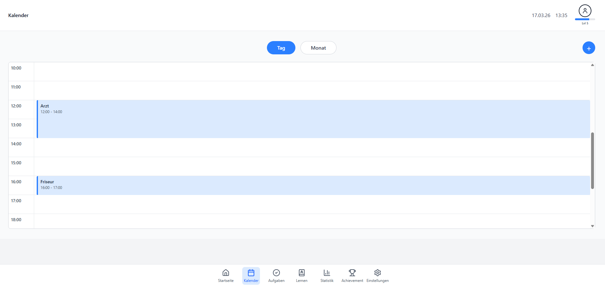
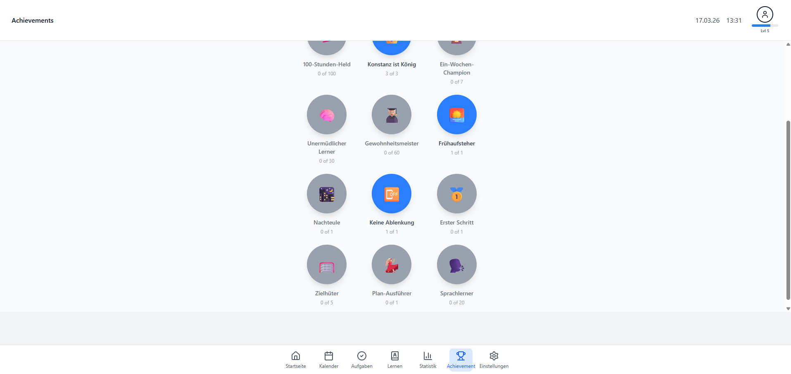
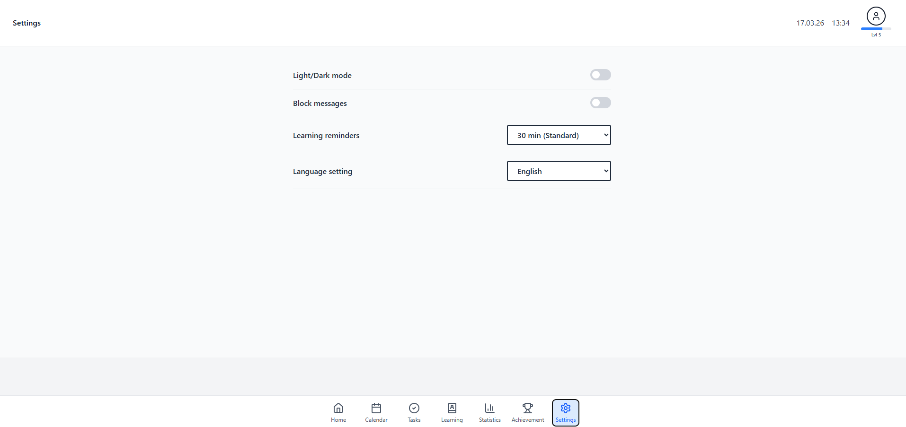

# HCI - Gruppe 14 - MyStudyPal

## Anmerkung zur Dokumentation

Dokumentation für alle 4 Meilensteine ist im Ordner `docs` zu finden.

## Umgebung

Vor der Einstellung muss Node.js heruntergeladen und installiert werden. [Link zum Download](https://nodejs.org/en/download/current)

Testen der Installation im Terminal:
```
node -v
```

Dann sollen die folgenden Komponente installiert werden:

npm installieren (nodejs package manager):
```
npm install
```

Testen:
```
npm -v
```

yarn installieren:
```
npm install –g yarn
```

Testen:
```
yarn –version 
```

## Getting started


Für die Einstellung der Umgebung:

1. Zunächst muss das Projekt-Repository geklont und in WebStorm geöffnet werden.

2. Dann sollte man alle Abhängigkeiten (dependencies) mit npm in WebStorm Terminalkonsole im Projektverzeichnis (`...\hci-gruppe-14-mystudypal`) installieren:

```
npm install
```

3. Projekt starten:
```
npm run dev
```

Für Debugging auf einem anderen Gerät (z.B Handy):
```
npm run dev -- --host
```

Auf dem Testgerät local IP mit Port eingeben, z.B `http://192.168.1.125:5173/`

Die Webseite wird in Browser angezeigt.


## Testanweisungen für Achievements:

- Achievement: id: 12, name: 'Erster Schritt'.
- Achievement: id: 14, name: 'Plan-Ausführer'.  
  In TodoPage, fügen Sie 2 oder mehrere Todos hinzu. Nachdem Sie die erste To-Do-Kästchen abgehakt hatte, wird das Achievement 'Erster Schritt' in AchievementPage als 'achieved' angezeigt. Wenn Sie alle To-Do-Kästchen abgehakt hatte, wird das Achievement 'Plan-Ausführer' in AchievementPage als 'achieved' angezeigt.   
  Falls Sie wieder testen wollen, geben Sie bitte 'localStorage.clear();' in Ihrem Browser Consoler ein.

## Screenshots






## Release Notes

| Datum      | Beschreibung                                                                                                                 |
|------------|------------------------------------------------------------------------------------------------------------------------------|
| 11.11.2025 | feat: make header and bottom bar, base structure of project                                                                  |
| 23.11.2025 | docs: add getting started for setting environment                                                                            |
| 15.12.2025 | implementing CalenderPage und AchievementPage                                                                                |
| 17.12.2025 | added basic learning timer (start, pause, stop) with hourglass animation                                                     |
| 22.12.2025 | implemented learning/pause states with visual feedback (status headline, disabled buttons)                                   |
| 29.12.2025 | researching Recharts components                                                                                              |
| 30.12.2025 | created Git-issue with feature, wireframe, acceptance criteria and links                                                     |
| 02.01.2026 | begin implementing first components like TabView, TabHeader and TabContent                                                   |
| 02.01.2026 | testing and researching Chart components                                                                                     |
| 03.01.2026 | connected TanHeader and TabContent, added function for categories in TabHeader                                               |
| 03.01.2026 | debugging issues                                                                                                             |
| 05.01.2026 | implementing rest of TabHeader, added components AddCategory, CategoryContextMenu                                            |
| 06.01.2026 | added new components AddTodo and TodoContextMenu                                                                             |
| 06.01.2026 | implementing Layout for Homepage and SettingPage                                                                             |
| 06.01.2026 | Research and Debugging                                                                                                       |
| 07.01.2026 | started implementing new structure for TabContent (from table -> with style)                                                 |
| 07.01-2026 | Research, Debugging, Implementing of fixes                                                                                   |
| 08.01.2026 | feat: integrate ReactContext and localStorage to project                                                                     |
| 09.01.2026 | added in TabContent button for "Todo adding to LearningPage", first functional TodoPage with TabContent but no Overview      |
| 10.01.2026 | implementing full TabContent with Overview and all needed components                                                         |
| 10.01.2026 | added assistant popups for learning check, pause selection and resume flow                                                   |
| 10.01.2026 | Bug fixed Responsive Container                                                                                               |
| 11.01.2026 | feat: integrate all pages with react context and localstorage                                                                |
| 11.01.2026 | added todo selection for learning mode including duration display                                                            |
| 11.01.2026 | added component ProfileMocked for mocked User Profile, import in Header component                                            |
| 11.01.2026 | added hover function in TabContent for Todos and Time, added press-and-hold with finger on categories for mobile-application |
| 11.01.2026 | Updating and fixing display for Presentation                                                                                 |
| 12.01.2026 | implemented countdown timer based on summed todo durations                                                                   |
| 12.01.2026 | logic for Calendar Widget in Homepage and logic for AchievementPage                                                          |
| 13.01.2026 | implementing Dark mode for Header, Bottom Bar, HomePage, CalendarPage, AchievementPage and SettingPage                       |
| 13.01.2026 | Working and testing statistic data logic                                                                                     |
| 14.01.2026 | Working and testing statistic data logic                                                                                     |
| 15.01.2026 | fixed timer issues (multiple intervals, incorrect speed, popup timing)                                                       |
| 15.01.2026 | Working and testing statistic data logic                                                                                     |
| 16.01.2026 | Working and testing statistic data logic                                                                                     |
| 17.01.2026 | final refactor and bug fixes for LearningModePage                                                                            |
| 17.01.2026 | implementing Level Bar under User Profile                                                                                    |
| 17.01.2026 | added release-notes in ReadMe with mark down functionality                                                                   |
| 17.01.2026 | Added Button & Pupop for Dateselection, Reworked X/Y axis display, Bugfixing                                                 |
| 18.01.2026 | Updated Mocked Data, Kommented, Bugfixing                                                                                    |
| 18.01.2026 | feat(ui): make dark mode full release                                                                                        |
| 17.01.2026 | feat(ui): make dark mode full release                                                                                        |
| 17.01.2026 | feat(ui): make mobile mode full release                                                                                      |
| 18.01.2026 | feat(ui): make 2 language versions (de-en) for all sites with settings option                                                |


